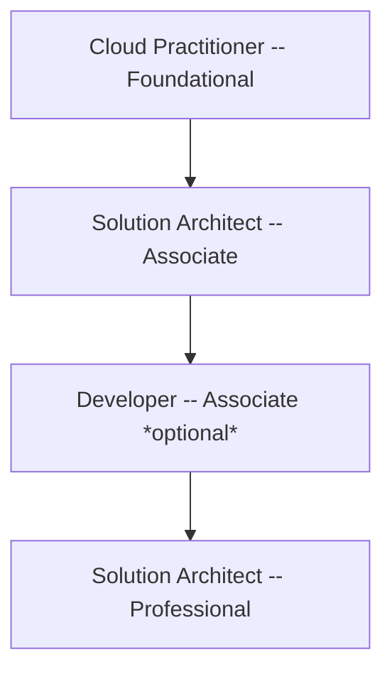

# AWS Certification

## Application architect roadmap

## Resources

### Cloud Practitioner

- [官方資源](https://aws.amazon.com/tw/certification/certified-cloud-practitioner/?c=sec&sec=resources)

- [官方考題範本](https://explore.skillbuilder.aws/learn/course/external/view/elearning/14050/aws-certified-cloud-practitioner-official-practice-question-set-cf-c02-english)

- [AWS free tier](https://aws.amazon.com/free/?all-free-tier.sort-by=item.additionalFields.SortRank&all-free-tier.sort-order=asc&awsf.Free%20Tier%20Types=*all&awsf.Free%20Tier%20Categories=*all)

- [Udemy](https://www.udemy.com/course/aws-certified-cloud-practitioner-new/?couponCode=ST18MT62524)
